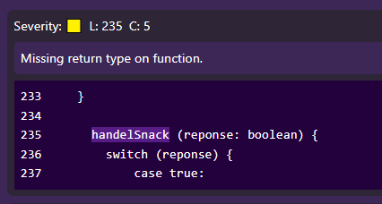

<div align="center">


<h1>📝 ESLint Parser 🚀🔍</h1>

<p> Welcome to ESLint Parser! <br> This project is designed to help you better visualize the output from your ESLint report. It allows you to parse the JSON and visualize the problems in a more user-friendly way.</p>
 </div>


## 🌐 Website
Check it out live on [ESLint Parser](https://eslint-parser.vercel.app/)

## 🎯 Project Goal
The primary goal of this project is to provide an easy-to-use tool to parse and visualize ESLint JSON output. If you've ever had trouble understanding what ESLint is telling you about your code, this tool is here to help. It transforms the raw JSON data into a visual format, making it easier to identify and understand the issues in your code.

## 📦 Example JSON Output
Here's an example of what ESLint JSON output might look like:

```json
{
  "severity": 2,
  "message": "Missing return type on function.",
  "line": 235,
  "column": 5,
  "nodeType": "FunctionExpression",
  "messageId": "missingReturnType",
  "endLine": 235,
  "endColumn": 16
}
```

 

## 💡 Usage
You can provide the JSON output directly to the ESLint Parser, or you can paste the JSON content into the web interface. It's designed to be user-friendly and flexible to suit your needs.

## 💻 Technologies Used
This project was built with the following technologies:
- [Sveltekit](https://svelte.dev/)
- [JSDoc](https://jsdoc.app/)
- [Tailwind CSS](https://tailwindcss.com/)

Feel free to contribute, report issues, or suggest improvements. Happy linting! 🚀🧹

🌟 Don't forget to give it a try on [ESLint Parser](https://eslint-parser.vercel.app/) and provide your valuable feedback. 🌟
